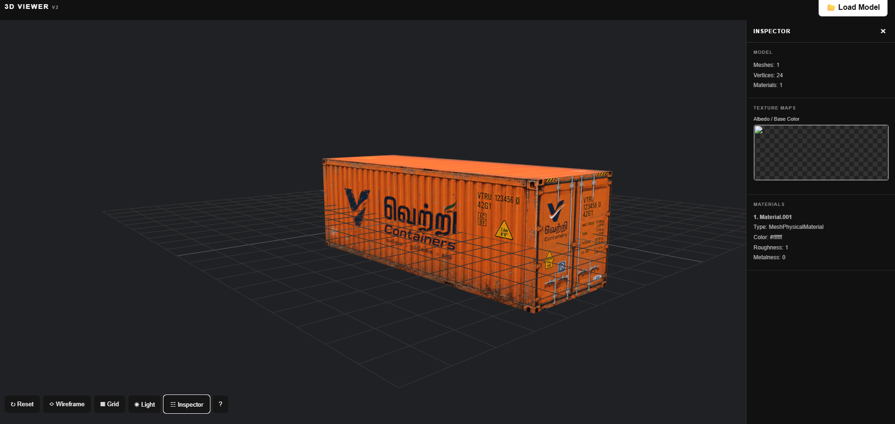

# gk_3D_Viewer — Sketch-lite

A simple and lightweight 3D model viewer built with **Three.js**.
Load and preview **GLB/GLTF** models with rotate, zoom, pan, lighting and wireframe options.

🔗 **Live Demo V1 ** (https://gk3dviewer.vercel.app/)

